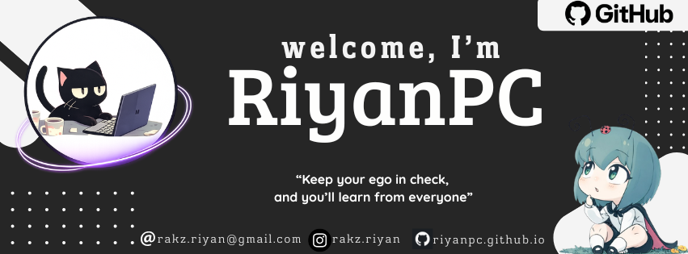

  

  

---

### Sobre Mí

<table align="center" width="100%">
  <tr>
    <td width="50%" style="vertical-align: top;">
      
<b>¿Quién soy?</b>

      
Soy un desarrollador apasionado por crear soluciones web robustas y estéticas. Me enfoco en el desarrollo Full Stack y siempre estoy buscando aprender nuevas tecnologías para llevar mis proyectos al siguiente nivel.

      
<b>Actualmente aprendiendo:</b> Node.js Avanzado y Arquitectura de Microservicios.

    </td>
    <td width="50%" style="vertical-align: top;">
      
<b>Cómo contactarme:</b>

      

         
         
        
      

    </td>
  </tr>
</table>

---

### Stack Tecnológico

  <table width="100%">
    <thead>
      <tr>
        <th width="30%">Categoría</th>
        <th width="70%">Tecnologías</th>
      </tr>
    </thead>
    <tbody>
      <tr>
        <td align="center"><b>Lenguajes</b></td>
        <td>
          
          
          
          
          
          
          
        </td>
      </tr>
      <tr>
        <td align="center"><b>Frontend</b></td>
        <td>
          
          
          
          
          
          
        </td>
      </tr>
      <tr>
        <td align="center"><b>Backend & BD</b></td>
        <td>
          
          
          
          
          
        </td>
      </tr>
      <tr>
        <td align="center"><b>Mobile & Otros</b></td>
        <td>
          
          
          
          
          
        </td>
      </tr>
    </tbody>
  </table>

---

### Estadísticas de GitHub

  
  
   
  

---

### Actividad Semanal

  

   
  

  <i>"El éxito no es el final, el fracaso no es fatal: es el coraje de continuar lo que cuenta."</i>

